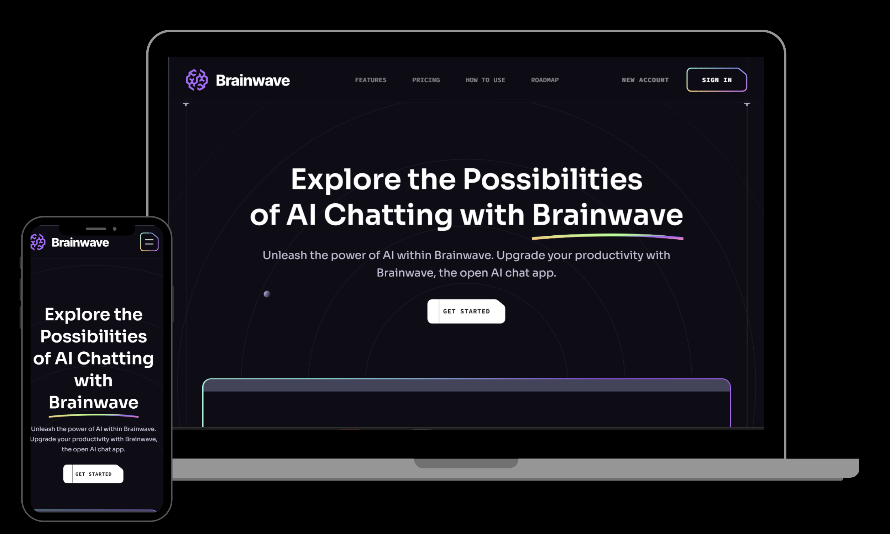

 

 

  

    
    
  

  <h3 align="center">Brainwave Clone</h3>

## 🤖 Introduction

Brainwave - Modern UI/UX website, developed using React.js and Tailwind CSS, exemplifies modern UI/UX principles. Its sleek design, seamless animations, and overall user experience set a high standard, serving as a reference or inspiration for future modern applications or websites in general.

## 🚨 Shoutout

- Thank you, JavaScript Mastery for the reference and ideas.

## ⚙️ Tech Stack

- React.js
- Tailwind CSS
- Vite

## 🔋 Features

👉 Beautiful Sections: Includes hero, services, features, how to use, roadmap, pricing, footer, and header.

👉 Parallax Animations: Engaging effects triggered by mouse movement and scrolling

👉 Complex UI Geometry: Utilizes tailwindcss for intricate shapes like circular feature displays, grid lines, and side lines.

👉 Latest UI Trends: Incorporates modern design elements such as bento grids.

👉 Cool Gradients: Enhances visuals with stylish gradients using Tailwind CSS for cards, buttons, etc.

👉 Responsive: Ensures seamless functionality and aesthetics across all devices

and many more, including code architecture and reusability
